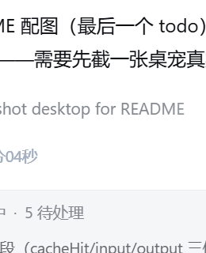

# RyderBaby 🐱

程序员桌面宠物 —— 把 AI 编码的 token 消耗与任务状态，变成一只趴在屏幕角落的伙伴。



监控 **DeepSeek Harness（DSH）**、**Claude Code**、**OpenAI Codex** 等 agent 的用量与任务，任务完成/失败/断线/token 超预算时，通过桌宠动画 + 系统通知 + **钉钉等群机器人**推送提醒，还能按会话（项目）区分是哪一次对话的任务。

## 功能

- **Token 实时监控**：厂商真实 usage（input / output / cache），按会话独立累计，多 agent 并发不串账
- **对话级归因**：每回合 token 增量独立统计，知道"哪个 agent 的哪一轮对话花了多少"
- **花费估算**：按实际计价规则（缓存命中/未命中输入/输出三价，可手动配置），HUD、统计页、推送卡片统一显示 `💰 ≈¥x.xx`
- **任务完成推送**：回合/工作流/子任务结束时推送**结构化卡片**，标记来源 Agent 与「对话名称」（如 `✅ DSH · 回合完成 ·「电脑桌宠监控与提醒构思」`）
- **分级提醒**：任务级（workflow/子任务/会话）推卡片；命令级（npm、脚本等 job）默认静默，可单独开启
- **强提醒**：任务结束声音 + 动画（可开关）
- **钉钉群机器人**：webhook + 加签，设置页一键配置与测试
- **多 Agent 监控**：DSH + Claude Code + Codex 各自独立「监控/推送」开关
- **统计曲线**：ECharts 按天/按小时展示 token 消耗，窗口可拉伸自适应
- **自定义外观**：6 个真实状态各自可配图标（emoji/图片）与状态文字
- **会话标题**：推送卡片自动带出对话名称，多项目一眼区分
- **中英文界面**、无边框设置窗口

## 架构

```
DSH (llm/stream 瀑布流 + 事件) ──SSE──► Electron 桌宠
Claude Code / Codex (jsonl 日志) ──────►  │  ├─ 提醒引擎（分级/去重）
                                          │  ├─ PushRouter（钉钉等渠道）
                                          │  ├─ 本地事件存储（JSON，离线可用）
                                          │  └─ 统计/设置（React + ECharts）
```

- `desktop/` — Electron + React + TypeScript（electron-vite）
- DSH 侧数据管线是动态插件 `pet-bridge`（llm/stream 拦截 + 事件折叠 + SSE 端点），生产化后可迁为宿主级持久插件

## 快速开始

```bash
cd desktop
npm install
npm run dev        # 开发运行
npm run build      # 构建
npm run dist:win   # 打包 Windows 安装包
```

配置：托盘 → 设置 → 推送渠道 → 填入钉钉群机器人 webhook（可选加签 Secret）→ 发送测试推送。

## 隐私

- 只记录 usage 数字与事件标量字段，**不落盘任何 prompt / 响应内容**
- 所有统计本地完成，不联网上报

## 技术栈

Electron · React · TypeScript · ECharts · electron-vite · electron-builder
